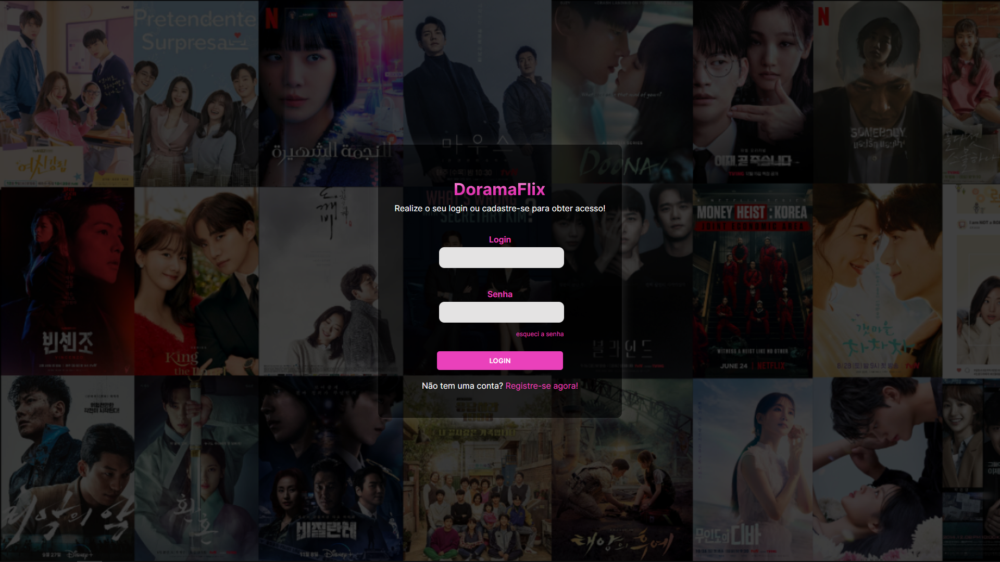

# DoramaFlix

Site para organizar e avaliar séries e filmes coreanos.

## 📖 Resumo do projeto

- Criado em 14/01/2024 (atualizado em 13/04/2024)

- A ideia desse projeto é criar um site para organizar séries e filmes coreanos.

## 📱 Funcionalidades do projeto

- Funcionalidade: no momento este projeto contém três telas, a home, tela de cadastro e a tela de login. 

- Site 100% responsivo, mas ainda sem funcionalidades.

## 👨🏽‍💻 Tecnologias utilizadas

- HTML5
- CSS3

## 💻 Design

- Home:

- Tela de Cadastro:

- Tela Login:

